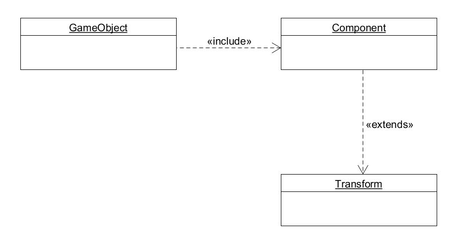

> What you want to say.

# 简答题
- 解释 游戏对象（GameObjects） 和 资源（Assets）的区别与联系。
    + 游戏对象是描述Unity编辑游戏世界中的任意个体的名称。
    + 资源是Unity编辑时可使用来创建生成相应的游戏对象的称呼。
- 下载几个游戏案例，分别总结资源、对象组织的结构（指资源的目录组织结构与游戏对象树的层次结构）
    + 资源结构：根据动作、音频、材质、模型、脚本、文本、第三方资源等来分类。
    + 对象结构：根据环境、每个独特的个体来组织，而个体中又包含各种更细的对象。
- 编写一个代码，使用 debug 语句来验证 MonoBehaviour 基本行为或事件触发的条件。
  基本行为包括 Awake() Start() Update() FixedUpdate() LateUpdate()；
  常用事件包括 OnGUI() OnDisable() OnEnable()。
    +   ``` C#
        using UnityEngine;

        public class CallOrderTest : MonoBehaviour {

            void Awake()
            {
                Debug.Log("CallOrderTest::Awake Called");
            }

            void Start ()
            {
                Debug.Log("CallOrderTest::Start Called");
            }
            
            void Update ()
            {
                Debug.Log("CallOrderTest::Update Called");
            }

            void FixedUpdate()
            {
                Debug.Log("CallOrderTest::FixedUpdate Called");
            }

            void LateUpdate()
            {
                Debug.Log("CallOrderTest::LateUpdate Called");
            }


            void OnGUI()
            {
                Debug.Log("CallOrderTest::OnGUI Called");
            }

            void OnEnable()
            {
                Debug.Log("CallOrderTest::OnEnable Called");
            }

            void OnDisable()
            {
                Debug.Log("CallOrderTest::OnDisable Called");
            }
        }
        ```
- 查找脚本手册，了解 GameObject，Transform，Component 对象
    + 分别翻译官方对三个对象的描述（Description）
        - GameObject：游戏中的每个对象都是一个游戏对象，从角色和可收藏的物品到灯光，相机和特效。
        - Transform：变换组件确定场景中每个对象的位置，旋转和缩放比例。每个GameObject都有一个变换组件。
        - Component：组件是游戏中对象和行为的细节。它们是每个GameObject实现功能的部分。
    + 描述下图中 table 对象（实体）的属性、table 的 Transform 的属性、table 的部件。
      
      - table对象属性：activeInHierarchy、activeSelf、isStatic、layer、scene、tag、transform；
      - table的Transform属性：position、rotation、scale；
      - table的部件：Transform、Cube、BoxCollider、MeshRenderer；
    + 本题目要求是把可视化图形编程界面与 Unity API 对应起来，当你在 Inspector 面板上每一个内容，应该知道对应 API。
      例如：table 的对象是 GameObject，第一个选择框是 activeSelf 属性。
      用 UML 图描述 三者的关系（请使用 UMLet 14.1.1 stand-alone版本出图）
      
- 整理相关学习资料，编写简单代码验证以下技术的实现：
    + 查找对象
        ``` C#
        GameObject.Find("Name");
        GameObject.FindGameObjectsWithTag("TagName");
        GameObject.FindWithTag("TagName");
        GameObject.FindObjectOfType("TypeName");
        GameObject.FindObjectsOfType("TypeName");
        ```
    + 添加子对象
        ``` C#
        son.transform.parent = daddy.transform;
        ```
    + 遍历对象树
        ``` C#
        foreach (Transform t in transform) {
            // do something
        }
        ```
    + 清除所有子对象
        ``` C#
        foreach (Transform t in transform) {
            GameObject.Destroy(t.gameObject);
        }
        ```
- 资源预设（Prefabs）与 对象克隆 (clone)
    + 预设（Prefabs）有什么好处？
        - 预制是一种资源 - 存储在项目视图中的可重用GameObject。预设可以插入到任意数量的场景中，每个场景可多次。将预设件添加到场景时，可以创建它的一个实例。所有Prefab实例都链接到原始的Prefab，并且都是它克隆出来的。非常方便多次使用。
    + 预设与对象克隆 (clone or copy or Instantiate of Unity Object) 关系？
        - 基本没有关系，只是表面上看起来都拥有从一个已有的东西上复制出多个同样的东西的特性。
    + 制作 table 预设，写一段代码将 table 预设资源实例化成游戏对象
        ``` C#
        using UnityEngine;

        public class UsePrefab : MonoBehaviour {
            void Start () {
                GameObject table = Instantiate(Resources.Load("table")) as GameObject;
            }
        }
        ```
- 尝试解释组合模式（Composite Pattern / 一种设计模式）。
    + 组合模式是将一些对象通过组合的形式（而非继承）构成树形结构，来突出部分--整体的层次结构，使用者可以发现单个对象和组合对象的使用具有一致性。
    + 使用 BroadcastMessage() 方法向子对象发送消息
    ``` C#
    void Sample() {
        gameObject.BroadcastMessage("ApplyDamage", 5.0F);
    }
    ```